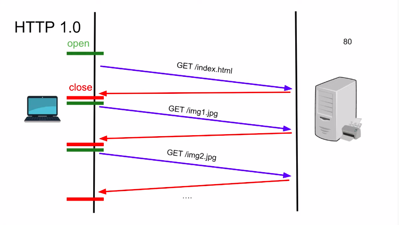
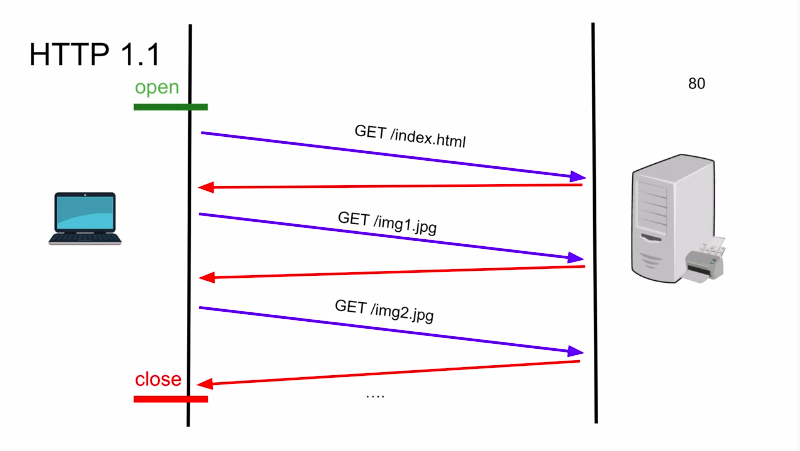
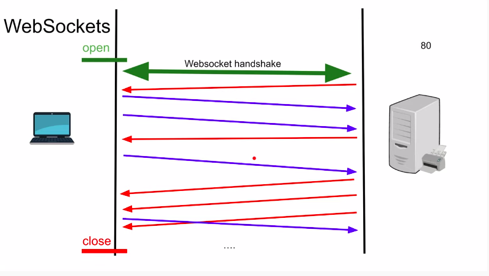
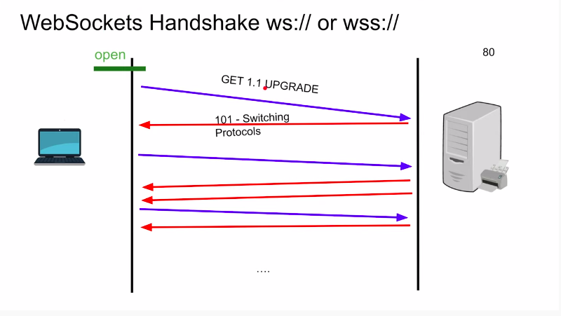
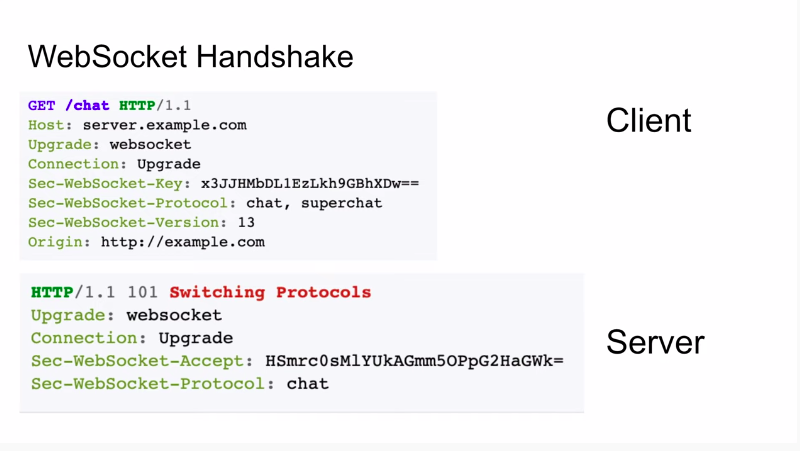

# Socket.io

## Learning Socket.io

**Bidirectional communication protocol**

---

**Agenda**

	** HTTP
	** WebSockets
	** WebSockets Handshake
	** Websockets use caes
	** WebSockets Example (Code!)
	** WebSockets Pros and Cons
	

## HTTP

> HTTP 1.0 Tech was invented in 1995

> HTTP 1.1 That's what Socket build on (leave the connexion open)

## WebSockets

> use HTTP 1.1 it's statefull and none stateless u can kill the server ...

 
> WebSockets Handshake ws:// or wss// using tls it became wss
 

 
`
What thas Websocket handshake looking like
`
 

  
>WebSocket.io do this handshake for us , so it makes it more easy
  
  
 
## WebSockets use cases

 * Chatting
 * Live Feed
 * Multiplayer gaming
 * Showing client progress/logging
 

## Coding Time

> Look the file up

** Raw Websocket client/server

 
 
 
 
 
 
 
 
 
 
 
